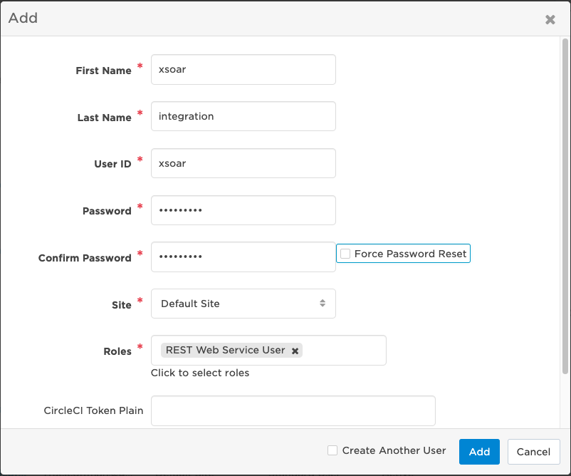
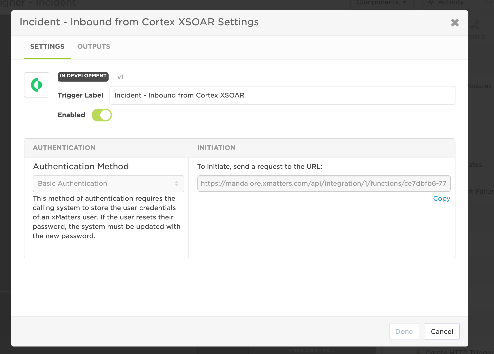
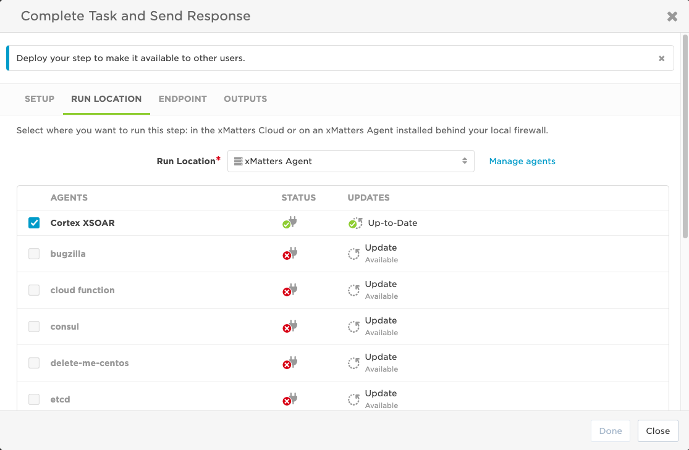
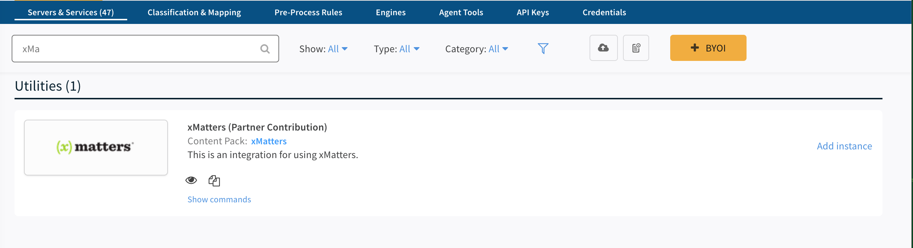
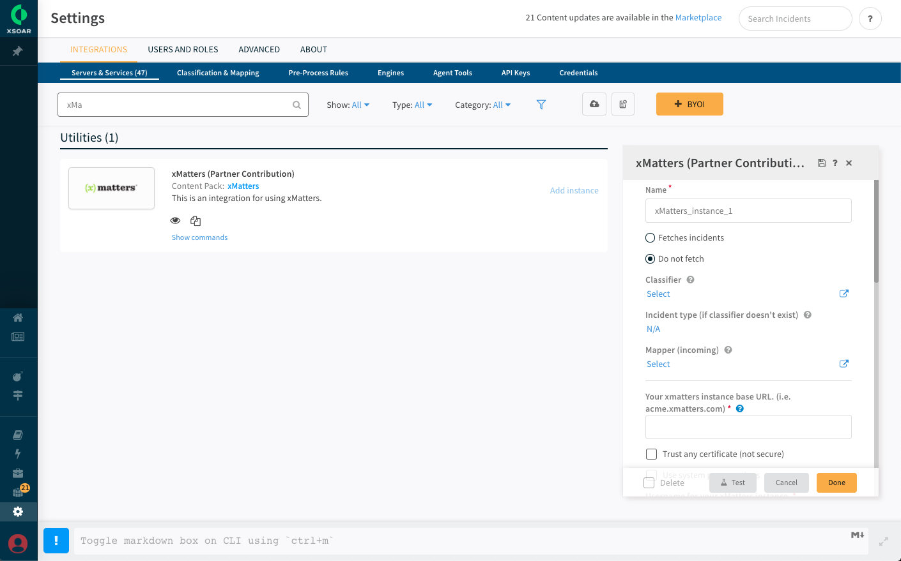
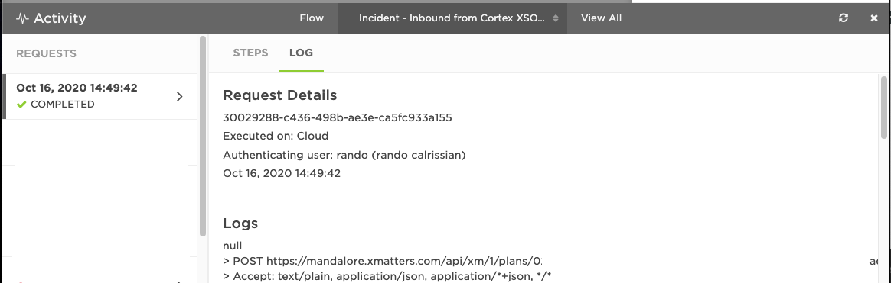
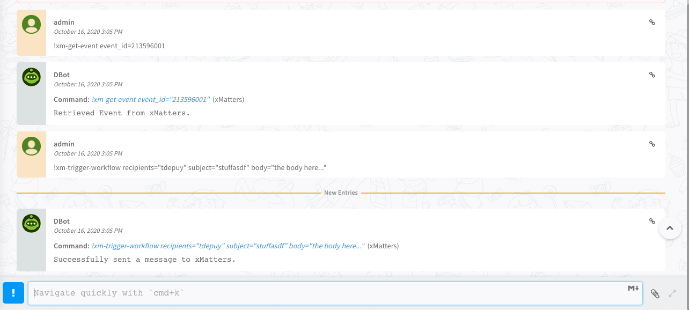

# XSOAR to xMatters Integration

Cortex XSOAR is a premier security orchestration tool for keeping organizations secure. With the xMatters integration, use a playbook command to trigger a workflow and deliver incident information to on-call resources.

---------

<kbd>
  
</kbd>

---------

# Pre-Requisites
* XSOAR 5 or 6
* xMatters account - If you don't have one, [get one](https://www.xmatters.com)!
* [xMatters Agent](https://help.xmatters.com/ondemand/xmodwelcome/xmattersagent/xmatters-agent-topic.htm) - If XSOAR is not available via the public internet, the agent will be needed to facilitate the communication from xMatters to XSOAR.

# Files
* [CortexXSOAR.zip](CortexXSOAR.zip) - The workflow containing the flow canvases and event forms.

# How it works
The `xm-trigger-workflow` command can be inserted into a playbook or executed from the warroom. The various parameters can be passed to the workflow on the xMatters side to target the `recipients` value. Response options on the notifications allow for continuation or branching of the playbook if a `close_task_id` value is passed. The integration comes with an example playbook showing how to branch based on a user response. 

The `fetch_incidents` functionality queries xMatters for events based on the search criteria and creates incidents in XSOAR for each one. 

# Installation

## xAgent
For full roundtrip integration, the [xMatters Agent](https://help.xmatters.com/ondemand/xmodwelcome/xmattersagent/xmatters-agent-topic.htm) will facilitate the communication from xMatters to XSOAR. When the agent is installed, then continue. 

## xMatters set up

### Create an XSOAR user

1. Navigate to the Users menu and create a new user for XSOAR to authenticate with. Grant the **REST Web Service User** role.

### Import the Workflow

1. Log in to xMatters as a Company Supervisor or a Developer and navigate to the Workflows page. Click the **Import** button and import the [CortexXSOAR.zip](CortexXSOAR.zip) file. 
2. Open the workflow and navigate to the Flows tab.
3. Click on the **Incident** canvas and then double click on the **Incident - Inbound from Cortex XSOAR** HTTP Trigger.

4. Copy the url and save for later. 
5. Double click on the **Complete Task and Send Response** step attached to the **Responses** trigger to open the dialog. Then navigate to the **Run Location** tab. 

6. Select the appropriate agent from the list, then navigate to the **Endpoint** tab and click the **Edit Endpoints** link.
7. In the dialog presented, update the **Base URL** to point to the XSOAR front end. 

8. Close the dialogs and click the **Components** drop down in the upper right corner of the canvas and select **Constants**. Note the **Cortex XSOAR API Key** constant is where the XSOAR API key will be stored so that xMatters can successfully authenticate.
9. On the Forms tab, click the **Not Deployed** dropdown next to **Incident** and select Sender Permissions. Add the XSOAR user created above. 
11. Click the gear icon and choose Editor permissions. Add the XSOAR user here as well. 

## XSOAR Set Up

1. Navigate to the marketplace and search for "xMatters". Click the **Install** button in the top corner.
2. Then in the **Settings**, find the xMatters integration and click the **Add instance** button:

3. Enter the appropriate details, including the user created above. Click **Done**.
4. Navigate to **Settings** and click the **API Keys** section. Click **Get Your Key** to generate a new key. Add this key to the **Cortext XSOAR API Key** constant in xMatters referenced above. 
4. Associate the **xMatters - Wait For Response** playbook with an incident to trigger an event. This will depend on the business use case. 

# Testing
The Test button on the integration instance will test the trigger workflow command as well as an API call to the user.

After pressing the Test button and getting the Success message, a new entry will be displayed in the Activity Stream:

Alternatively, the commands can be executed in the Playground.

# Troubleshooting
The `/var/logs/demisto` directory on the XSOAR server is the first place to look. This will have any exceptions thrown by the python code. 

Also, the activity stream in xMatters will show any errors that occur once the `xm-trigger-workflow` request gets into xMatters. 

