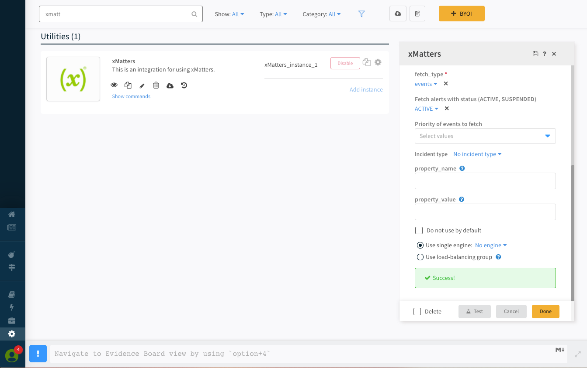

# XSOAR to xMatters Integration

Cortex XSOAR is a premier security orchestration tool for keeping organizations secure. With the xMatters integration, use a playbook command to trigger a workflow and deliver incident information to on-call resources.

---------

<kbd>
  
</kbd>

---------

# Pre-Requisites
* XSOAR 6
* xMatters account - If you don't have one, [get one](https://www.xmatters.com)!
* [xMatters Agent](https://help.xmatters.com/ondemand/xmodwelcome/xmattersagent/xmatters-agent-topic.htm) - If XSOAR is not available via the public internet, the agent will be needed to facilitate the communication from xMatters to XSOAR.

# Files
* [CortexXSOAR.zip](CortexXSOAR.zip) - The workflow containing the flow canvases and event forms.

# How it works
The `xm-trigger-workflow` command can be inserted into a playbook or executed from the warroom. The various parameters can be passed to the workflow on the xMatters side to target the `recipients` value. Response options on the notifications allow for continuation of the playbook if a `close_task_id` value is passed. 

The `fetch_incidents` functionality queries xMatters for events based on the search criteria and creates incidents in XSOAR for each one. 

# Installation

## xMatters set up

### Create an XSOAR user

1. Navigate to the Users menu and create a new user for XSOAR to authenticate with. Grant the **REST Web Service User** role.

### Import the Workflow

1. Log in to xMatters as a Company Supervisor or a Developer and navigate to the Workflows page. Click the **Import** button and import the [CortexXSOAR.zip](CortexXSOAR.zip) file. 
2. Open the workflow and navigate to the Flows tab.
3. Click on the **Incident** canvas and then double click on the **Incident - Inbound from Cortex XSOAR** HTTP Trigger.

4. Copy the url and save for later. 
9. On the Forms tab, click the **Not Deployed** dropdown next to **Incident** and select Sender Permissions. Add the XSOAR user created above. 
11. Click the gear icon and choose Editor permissions. Add the XSOAR user here as well. 

## XSOAR set up
See the full documentation in the [xMatters Integration](https://xsoar.pan.dev/docs/reference/integrations/zoom).

# Testing
The Test button on the integration instance will test the trigger workflow command as well as an API call to the user.

After pressing the Test button and getting the Success message, a new entry will be displayed in the Activity Stream:

Alternatively, the commands can be executed in the Playground.

# Troubleshooting
The `/var/logs/demisto` directory on the XSOAR server is the first place to look. This will have any exceptions thrown by the python code. 

Also, the activity stream in xMatters will show any errors that occur once the `xm-trigger-workflow` request gets into xMatters. 

